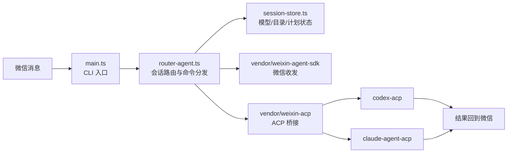

# weixin-acp-router

仓库地址：`https://github.com/DawnJson/weixincli`
问题反馈：`https://github.com/DawnJson/weixincli/issues`

基于 `wong2/weixin-agent-sdk` 构建的微信路由工作区。

## 项目结构与流程

```text
packages/
  weixin-acp-router/
    main.ts                 CLI 入口
    src/
      router-agent.ts       会话路由、命令分发、模型切换
      session-store.ts      会话状态、工作目录、待确认计划
      vendor/
        weixin-acp/         ACP 桥接层
        weixin-agent-sdk/   微信接入层
```

原来的 `packages/sdk` 和 `packages/weixin-acp` 代码已经内置到 `packages/weixin-acp-router/src/vendor`，因此当前项目不再依赖这些本地工作区包。



## weixin-acp-router

`weixin-acp-router` 会启动一个微信 Bot 进程，并接入两个 ACP 后端：

- `codex` -> `codex-acp`
- `claude` -> `claude-agent-acp`

按你希望的默认模型启动：

```bash
npx weixin-acp-router codex
npx weixin-acp-router codex resume <sessionId>
npx weixin-acp-router claude
npx weixin-acp-router claude resume <sessionId>
```

## 微信命令与行为

- 普通消息：发送到当前微信会话当前绑定的模型。
- 启动命令：决定一个会话首次使用前的默认路由。
- `/help`：查看当前微信侧支持的命令说明。
- `/codex` 和 `/claude`：持久切换当前微信会话所使用的模型。
- `/codex <message>` 和 `/claude <message>`：先切模型，再立即转发消息。
- `/cd <path>`：修改当前微信会话的工作目录。
- `/pwd`：查看当前微信会话的工作目录。
- `/sessions`：查看当前模型最近 5 个会话。
- `/sessions codex` 和 `/sessions claude`：查看指定模型最近 5 个会话，但不切换当前聊天路由。
- `/plan`：让当前模型进入规划模式。
- `Claude` 的 `/plan`：使用官方 ACP 原生 `plan` mode。模型会先进入规划态，产出计划后，微信侧会收到计划内容；只有用户回复 `/do` 后才会继续执行，回复 `/undo` 则放弃本次计划。
- `Codex` 的 `/plan`：不是官方 ACP 原生 `plan` mode，而是项目内实现的软规划流程。模型会先按普通对话产出一份计划，系统把这份计划缓存为“待确认计划”，然后回发到微信，等待用户决定。
- `/do`：执行当前聊天里待确认的计划。
- `/undo`：丢弃当前聊天里待确认的计划。
- `/unplan`：把当前模型切回 `default` 模式。
- `plan` 许可流程：无论当前是 Claude 还是 Codex，计划都不会在回发后立刻执行；必须由用户在微信里显式回复 `/do` 才会开始执行，回复 `/undo` 则直接取消。
- `plan` 结束方式：执行完 `/do` 后，会话会回到普通执行流程；如果只想退出规划态而不执行，可以用 `/undo` 或 `/unplan`。
- `/resume latest`：恢复当前工作目录下当前模型最近一次会话。
- `/resume <sessionId>`：恢复当前模型的指定会话 ID。
- `/resume codex <sessionId>` 和 `/resume claude <sessionId>`：恢复指定模型会话，并把当前聊天切到该模型。
- `/resume codex latest` 和 `/resume claude latest`：恢复指定模型在当前工作目录下最近一次会话，并切换当前聊天。
- 使用 `npx weixin-acp-router codex resume <sessionId>` 或 `npx weixin-acp-router claude resume <sessionId>` 启动时，会在默认模型首次被使用时恢复指定会话。
- 会话隔离：Codex 和 Claude 会分别为每个微信会话维护各自独立的 ACP 会话。
